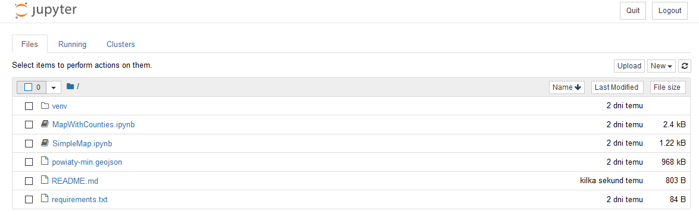

# Wizualizacje oparte o mapy w Jupyter Notebook

Wizualizacje z użyciem danych geograficznych w Jupyter Notebook.


## Instalacja 

Aby uruchomić notatniki Jupyter należy zainstalować potrzebne zależności. Można to zrobić z wykorzystaniem poniższych poleceń.

Instalacje wystarczy wykonać raz, przed pierwszym uruchomieniem projektu.

```
pip install --upgrade pip
pip install -r requirements.txt
```

Wszystkie wymagane biblioteki zostały wylistowane w pliku `requirements.txt`.

## Uruchomienie 

Aby uruchomić notatniki Jupyter należy wystartować serwer poleceniem:

```
jupyter notebook
```

Powinno ono automatycznie otworzyć domyślną przeglądarkę na stronie listy plików tego repozytorium (jak na poniższym obrazie). Należy kliknąć notatnik (pliki z ikoną notatnika i rozszerzeniem pliku .ipynb), aby go otworzyć.




### Materiały dodatkowe

https://ipyleaflet.readthedocs.io/en/latest/api_reference/basemaps.html

