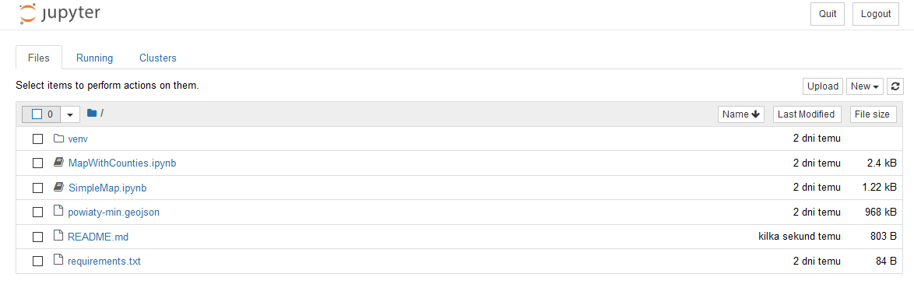
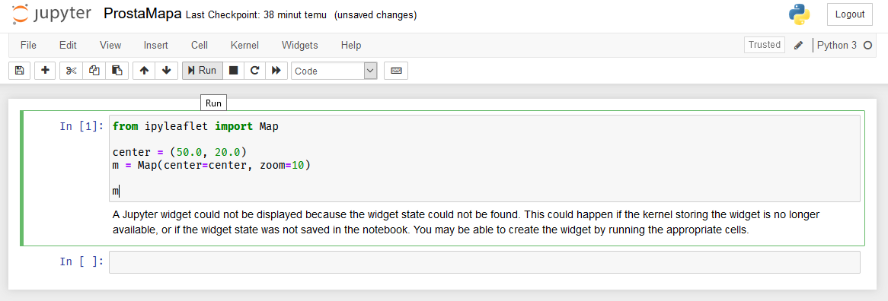
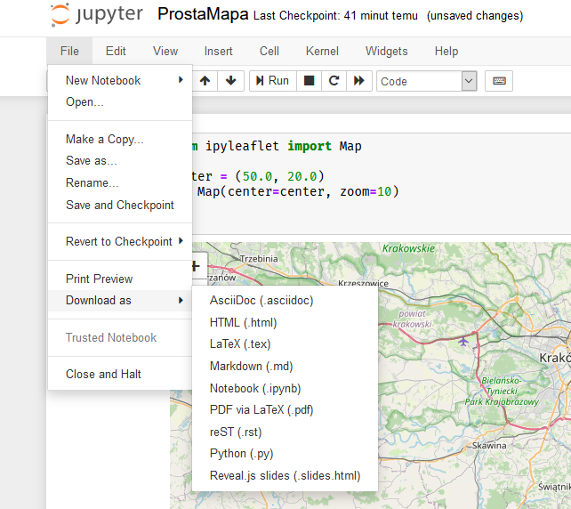
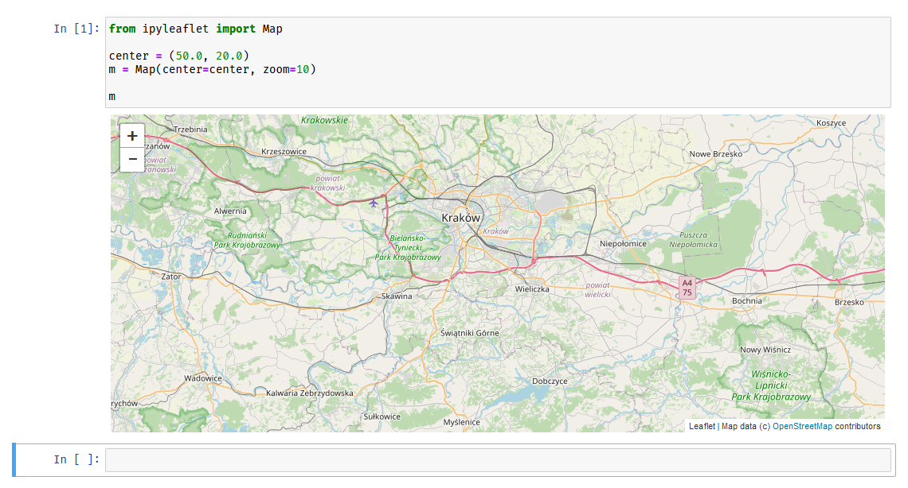
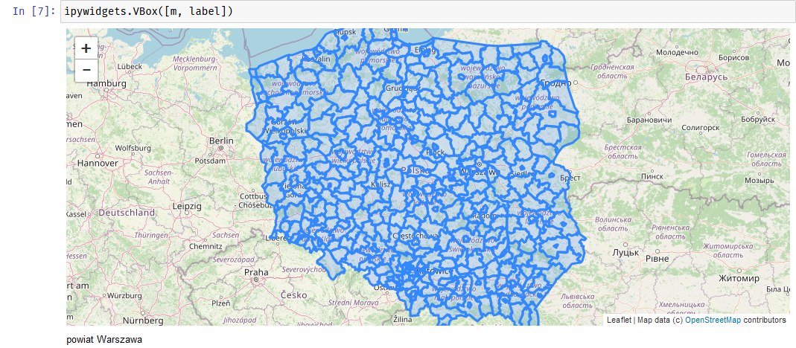

# Wizualizacje oparte o mapy w Jupyter Notebook

Wizualizacje z użyciem danych geograficznych w Jupyter Notebook.

## Wymagania systemowe

Zainstalowany interpreter języka Python 3.6+ https://www.python.org/

## Instalacja 

Aby uruchomić notatniki Jupyter należy zainstalować potrzebne zależności. Można to zrobić z wykorzystaniem poniższych poleceń.

Instalacje wystarczy wykonać raz, przed pierwszym uruchomieniem projektu.

```
python -m pip install --upgrade pip
pip install -r requirements.txt
```
_Jeśli powyższe polecenie pip nie zostaje rozpoznane przez system można spróbować `python -m pip install`._

Wszystkie wymagane biblioteki zostały wylistowane w pliku `requirements.txt`.

## Uruchomienie 

Aby uruchomić notatniki Jupyter należy wystartować serwer poleceniem:

```
jupyter notebook
```

Powinno ono automatycznie otworzyć domyślną przeglądarkę na stronie listy plików tego repozytorium (jak na poniższym obrazie). Należy kliknąć notatnik (pliki z ikoną notatnika i rozszerzeniem pliku .ipynb), aby go otworzyć.



W widoku konkretnego notatnika należy kliknąć opcję `Run` z menu, aby uruchomić/wygenerować wyniki. Wyniki map nie są zapisywane na stałe, więc przy każdym uruchomieniu notatnika trzeba je generować od nowa.



Notatniki z wynikami można eksportować do różnych formatów. Odpowiednie opcje znajdują się w menu `File`.



## Przykłady

`ProstaMapa.ipynb` - przykład z mapą wycentrowaną nad Krakowem. Można zmodyfikować dane w zmiennej `center` oraz `zoom` przekazany do obiektu mapy aby osiągnąć inne centrowanie i przybliżenie. 

Więcej przykładów i dokumentacja biblioteki do rysowania map dostępne: https://ipyleaflet.readthedocs.io/en/latest/api_reference/map.html#usage



---

`MapaZPowiatami.ipynb` - przykład, gdzie mapa jest wycentrowana na Polsce. Dodatkowo jest tu nałożona siatka powiatów wczytana z pliku `powiaty-min.geojson`.

Można wykorzystać inne siatki danych, jednak musza być w formacie GeoJSON aby ten przykład działał. Ten zestaw danych został zaczerpnięty z repozytorium: https://github.com/ppatrzyk/polska-geojson

Dodatkowo - w tym przykładzie można najechać myszką na powiat a pod mapą wyświetli się nazwa powiatu. Aby dodać dodatkowe informacje, które mogłyby wyświetlać się po najechaniu na powiat można zmodyfikować plik `powiaty-min.geojson`.

Inne przykłady wykorzystania GeoJSON: https://ipyleaflet.readthedocs.io/en/latest/api_reference/geo_json.html




### Materiały dodatkowe

- https://ipyleaflet.readthedocs.io/en/latest/api_reference/basemaps.html

